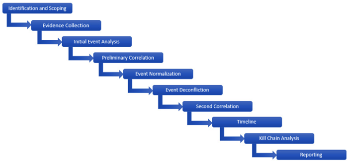
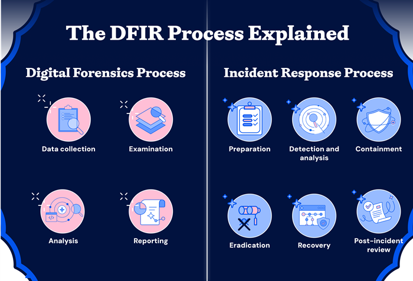
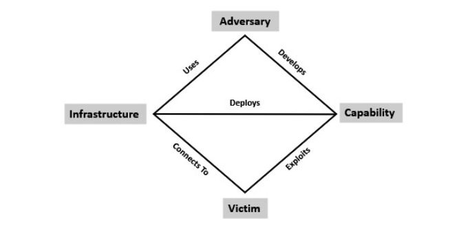
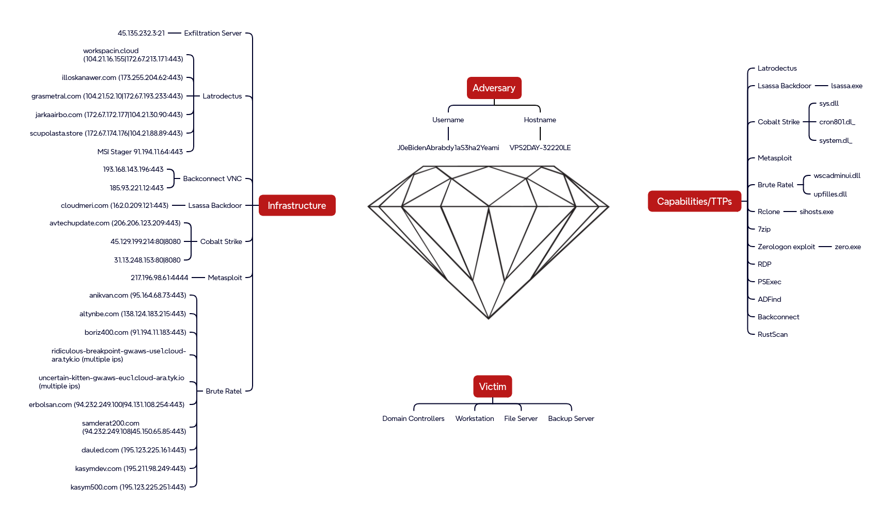

# Forensic investigation methodology
[Digital forensics](https://www.nist.gov/digital-evidence) is the field of forensic science concerned with ***retrieving, storing and analyzing*** data that can be useful in investigations. The main goal is to identify the **root cause** of an incident.  
This includes information retrieved from computers, mobile phones, IoT devices, motor vehicles, drones, satellites or the cloud. 
 

## A 10 step investigation methodology
The general approach of this methodology is the analysis of digital evidence to prove or disprove a hypothesis. [1]
 
*image source: Digital Forensics and Incident Response by Gerard Johansen*

## DFIR
The term **DFIR (Digital Forensics and Incident Response)** is often used referring to the broader discipline including incident response. 
This track focuses on the Digital Forensics process. 
For those seeking more info on Incident Response, refer to the [NIST Special Publication 800-61r3](https://csrc.nist.gov/pubs/sp/800/61/r3/final). [2] 
  
*image source: WIZ* 

## Phases of the [digital forensic process](https://www.unodc.org/cld/en/education/tertiary/cybercrime/module-4/key-issues/standards-and-best-practices-for-digital-forensics.html)
According to the standards and best practices for digital forensics published by [ISO](https://www.iso.org/home.html) (International Organization for Standardization) and [IEC](https://www.iec.ch/) (International Electrotechnical Commission) as ISO/IEC 27037 [3], the phases are:
- identification
- collection
- acquisition
- preservation 
The following phases are part of the forensic process, though not included in the ISO/IEC standards:
- analysis
- reporting

## Evidence
A key principle in forensics is **Locard's principle of exchange**, often summarized as "every contact leaves a trace".  
It states that when a criminal comes in contact with an object, or a person, a cross-transfer of **evidence** occurs.  
Main _**types of evidence**_ retrieved and analyzed:
- disk (files, logs, command history, browser artifacts, etc.)
- memory (process, linked libraries, network connections, etc.)
- network (pcaps, netflow, zeek logs, etc.)

### Indicators of compromise
IoCs (or eyeoks, depending on who you ask) represent evidence that an attacker has breached an entity’s network or endpoint. Indicators may be email based, network, host or behavioural. They may include:
- unusual network traffic
- suspicious file hashes
- malicious IPs/domains
- suspicious login failures
- unauthorized changes to system configurations, and more

IoCs can be: 
- atomic (IPs, domain names that tie back to an adversary C2 infrastructure)
- computed (hashes)
## Diamond model

  
*image source: Digital Forensics and Incident Response by Gerard Johansen, originally published in the [The Diamond Model of Intrusion Analysis](https://www.researchgate.net/publication/379381999_The_Diamond_Model_of_Intrusion_Analysis) by Sergio Caltagirone, Andrew Pendergast, Cristopher Betz*

## Case examples
[Cat's Got Your Files: Lynx Ransomware](https://thedfirreport.com/2025/11/17/cats-got-your-files-lynx-ransomware/)
- initial access: RDP with compromised credentials to internet-exposed system
- internal recon: enumerate virtual infrastructure and file shares using standard windows utilities and [netscan](https://www.softperfect.com/products/networkscanner/), then [NetExec](https://github.com/Pennyw0rth/NetExec)
- lateral movement: to Domain Controller via separate compromised domain account (likely obtained from initial access broker)
- persistence: create new accounts via [dsa.msc](https://learn.microsoft.com/en-us/windows-server/identity/ad-ds/manage-user-accounts-in-windows-server), install AnyDesk client 
- privilege escalation: add new accounts to privileged groups
- exfil: sensitive files from network shares, 7z compressed via temporary file service [temp.sh](http://temp.sh)
- c2: RDP, AnyDesk (installed but not used)
- ransomware deployment: delete backup jobs, deploy lynx across multiple backup and file servers via RDP 

*image source: the DFIR Report*

[From a Single Click: How Lunar Spider Enabled a Near Two-Month Intrusion](https://thedfirreport.com/2025/09/29/from-a-single-click-how-lunar-spider-enabled-a-near-two-month-intrusion/)
- initial access: javascript file disguised as tax form, downloads and executes Brute Ratel via MSI installer
- internal recon: standard windows utilities, ADFind, rustscan, powerview
- lateral movement: PsExec, custom tool using Zerologon (CVE-2020-1472), RDP
- persistence: registry Run key named Update executing Brute Ratel badger, custom .NET backdoor via scheduled task, setup an additional C2 channel
- privilege escalation: Windows’ Secondary Logon service to enable runas with admin credentials found in unattend.xml file, UAC bypass via Cobalt Strike [uac-token-duplication](https://hstechdocs.helpsystems.com/manuals/cobaltstrike/current/userguide/content/topics/post-exploitation_privilege-escalation.htm)
- exfil: Rclone, FTP
- c2: Latrodectus/BackConnect VNC, Brute Ratel, lsassa.exe .NET malware, metasploit, Cobalt Strike
- credential harvesting: lsass, Latrodectus stealer module extracted from Outlook by querying registry keys, unattend.xml file, [.ps1 file](https://github.com/sadshade/veeam-creds) targeting backup software Veeam 

*image source: the DFIR Report*

## Investigator's challenges
**Digital forensic investigators** face challenges such as:
- extracting data from damaged devices
- locating evidence among vast quantities of data
- ensuring that their methods capture data **reliably**, without altering it in any way

## Chain of custody
Preserving the *integrity* of the evidence (preventing alteration or deletion) is prioritized.  
**Chain of custody** is used to track evidence by documenting each person and organization who handles it, the date/time it was collected or transferred, and the purpose of the transfer. [4]  
 
Example [chain of custody form](https://www.oreilly.com/library/view/implementing-digital-forensic/9780128045015/XHTML/B9780128044544150142/B9780128044544150142.xhtml): 
 
*image source: Implementing Digital Forensic Readiness by Jason Sachowski*

## Summary
- digital forensics includes retrieving, storing and analyzing data
- DFIR includes incident response, out of scope for this track
- phases: identify, collect, analyze, report, preserve
- evidence sources: disk, memory, network
- DFIR case reports provide examples
- investigator's challenges: extraction, finding evidence in large amounts of data, reliability
- chain of custody is a priority
## Drills
### Challenge 1
Description
### Challenge 2
Description
### Challenge 3
Description

## References & further reading
[1] Digital Forensics and Incident Response, chapter 4. Investigation methodology, section "Functional digital forensic investigation methodology" by Gerard Johansen 
[2] [NIST Special Publication 800-61r3](https://csrc.nist.gov/pubs/sp/800/61/r3/final) 
[3] ISO/IEC 27037:2012  
[4] [Chain of custody](https://www.cisa.gov/sites/default/files/publications/cisa-insights_chain-of-custody-and-ci-systems_508.pdf) 
[+] [Overview of Digital Forensics, ISACA](https://www.isaca.org/resources/white-papers/overview-of-digital-forensics)
