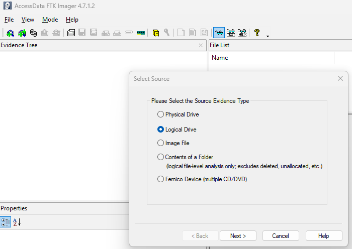
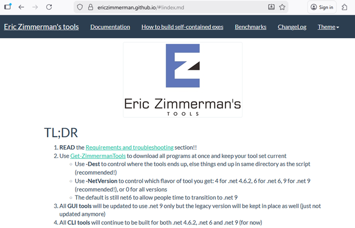
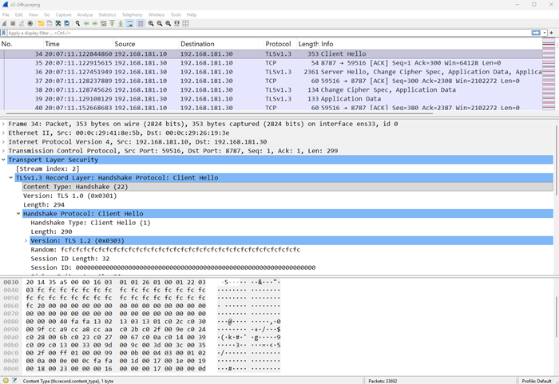
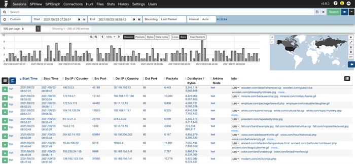
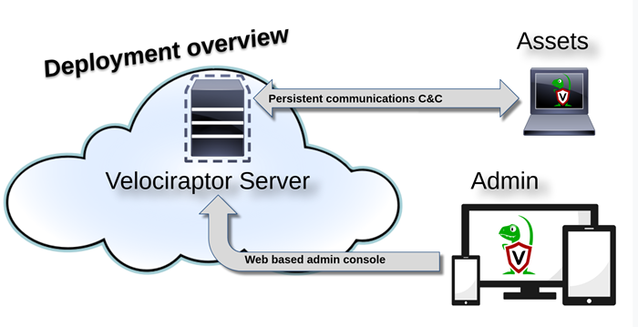

# Evidence acquisition & integrity
Digital forensics is concerned with "analyzing digital evidence in a manner that is legally acceptable in any legal proceedings”, thus evidence integrity is key. [1]<br /> 
After an incident has been identified and scoped, next comes the evidence collection phase.<br /> 
Collected evidence must:
- be relevant and of consequence to proving or disproving a hypothesis;
- have its integrity preserved.

## Evidence volatility
Evidence collection should be prioritized based on evidence volatility.<br />
According to the IETF [RFC 3227 - Guidelines for Evidence Collection and Archiving](https://www.ietf.org/rfc/rfc3227.txt), when collecting evidence you should proceed from the volatile to the less volatile. <br />
Here is an example order of volatility for a typical system.
-  registers, cache;
-  routing table, arp cache, process table, kernel statistics, memory;
-  temporary file systems;
-  disk;
-  remote logging and monitoring data that is relevant to the system in question;
-  physical configuration, network topology;
-  archival media.<br />

For example, if network logs roll over a 24h period, they should be acquired as soon as possible at the debut of the investigation, and then assess if they are required.

## Evidence acquisition - Host-based
From the hosts we usually collect disk and memory artifacts (_network captures can also be performed on a single host, but they are usually performed at the edge of a network perimeter_). <br />
Disk artifacts include:
- information about file system metadata (ex. $MFT file on windows)
- evidence of execution (ex. Prefetch files, SRUM)
- evidence of past file presence (ex. USN Journal, Windows Search Index)
- evidence of network communication (ex. BITS Database, packet capture)
- evidence of access (ex. shellbags)
- browser artifacts (ex. credentials, cookies, browsing history, etc)

Memory artifacts include memory dumps.

### UAC - [Unix-like Artifacts Collector](https://github.com/tclahr/uac)
Live collection tool for Unix-like operating systems.<br />
Usage: 
```
./uac -p ir_triage /tmp # Collect all artifacts based on the ir_triage profile, and save the output file to /tmp.
```
UAC comes with two basic pre-defined profiles:
- "ir_triage" – captures important system artifacts needed for typical investigations
- "full" – everything in "ir_triage" plus browser and other user application artifacts

### [FTK Imager](https://www.exterro.com/digital-forensics-software/ftk-imager)
Live collection tool to capture disk and memory on Windows. It has a free version and multiple capabilities. <br />
Options:
- create disk image
- capture memory

 <br />
*image source: FTK Imager*

### [EZ Tools](https://ericzimmerman.github.io/)
- KAPE - Kroll Artifact Parser and Extractor
- mftecmd (extract and parse MFT and USN Journal)
- pecmd (Prefetch parser)
- Registry Explorer (parser and viewer, fixes dirty hives)
- AppCompatCacheParser (shimcache, amcache parser)
- JLECmd (jumplist parser)

 <br />
*image source: ericzimmerman.github.io*

## Evidence acquisition - Network
### [tcpdump](https://www.tcpdump.org/)
Command line packet-capture and inspection tool, with powerful filtering capabilities. <br />
Usage:
```
sudo tcpdump -i eth0 # Capture all traffic on interface eth0
```
### [Wireshark](https://www.wireshark.org/download.html)
GUI packet-capture and inspection tool, allows analysis in a graphical interface, with shortcomings when it comes to large file sizes (it must load the entire .pcap file in memory). <br />
 <br />
*image source: Wireshark*

### [Arkime](https://github.com/arkime/arkime)
Arkime is an open-source network analysis and packet capture system that allows large-scale operations. Can be deployed on multiple systems and handle tens of GB/sec. 3 main components:
- capture
- viewer
- opensearch / elasticsearch

The GUI for exploring network data includes the Sessions page overview, listing individual sessions that can be expanded to view metadata and packet details.
<br />
_image source: [arkime](https://github.com/arkime/arkimeweb/blob/main/assets/sessions.png)_

## Evidence acquisition - Remote
### [Velociraptor](https://github.com/Velocidex/velociraptor)
Tool for collecting host based state information remotely via agents deployed on hosts. <br />
Typical deployment: <br />
 <br />
*image source: docs.velociraptor.app*

## Preserving integrity
It is recommended that a unique hash value per each file collected is calculated.<br/>
A hash is a numeric value of a fixed length that uniquely identifies data, computed based on a chosen algorithm.<br />
Commonly used algorithms:
- sha256
- sha1
- md5

### Hash verification
- sha256sum, shasum, md5sum<br />
Usage:
```
sha256sum <file.iso>
```
- certutil, Get-FileHash<br />
Usage:
```
certutil.exe -hashfile <file.iso> SHA1
Get-FileHash <file.iso> -Algorithm MD5
```

## Summary
- evidence must maintain integrity
- prioritize by volatility
- acquire data from hosts or network devices
- verify integrity
## Drills
### Challenge 1
Description
### Challenge 2
Description
### Challenge 3
Description

## References & further reading
[1] ISACA Whitepaper - [Overview of Digital Forensics](https://www.isaca.org/resources/white-papers/overview-of-digital-forensics)<br />
[+] IETF [RFC 3227 - Guidelines for Evidence Collection and Archiving](https://www.ietf.org/rfc/rfc3227.txt)<br />
[+] Hal Pomeranz's [Linux Forensics](https://archive.org/details/HalLinuxForensics)<br />
[+] UAC - [Unix-like Artifacts Collector](https://github.com/tclahr/uac)<br />
[+] [FTK Imager](https://www.exterro.com/digital-forensics-software/ftk-imager)<br />
[+] [EZ Tools](https://ericzimmerman.github.io/)<br />
[+] [tcpdump](https://www.tcpdump.org/)<br />
[+] [Wireshark](https://www.wireshark.org/download.html)<br />
[+] [Velociraptor](https://github.com/Velocidex/velociraptor)<br />
[+] [Artifact collection matrix](https://github.com/swisscom/ArtifactCollectionMatrix)<br />
