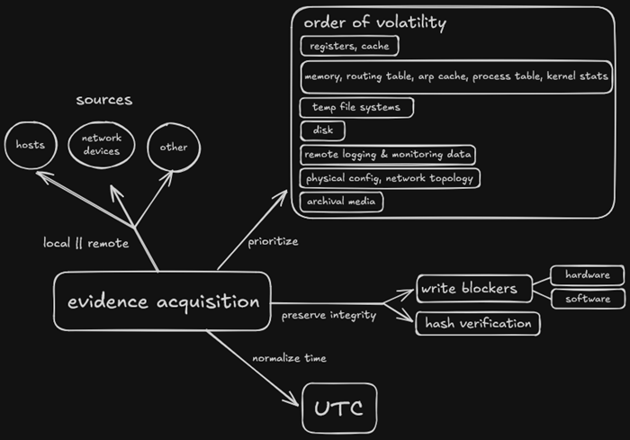

# Evidence acquisition & integrity

Digital forensics is concerned with "analyzing digital evidence in a manner that is legally acceptable in any legal proceedings", thus [evidence integrity](https://www.isaca.org/resources/white-papers/overview-of-digital-forensics) is key.<br />

Before touching any system:

- confirm you have written permission to collect data from it
- define the scope: which systems, what evidence, what time range
- assign an evidence custodian to maintain the chain of custody
- prepare the forensic workstation:
  - write blocker, imaging tools, and hashing tools ready
  - storage media wiped
- make note of every step taken in a documentation template

After an incident has been identified and scoped, next comes the evidence collection phase.<br />
Collected evidence must:

- be relevant and of consequence to proving or disproving a hypothesis
- have its integrity preserved
- be thoroughly documented

Choosing a collection tool depends on:

- is the system live or offline?
- what is the target OS?

## Prerequisites

- a unix forensic vm with
  - TSK
  - UAC
  - tcpdump
  - wireshark
- a windows forensic vm with
  - EZ Tools
  - KAPE

## Preserving integrity

### Write blockers

The forensic workstation doing the acquisition must not write anything back to the source disk.<br />
Even a simple OS action like updating a file's last-accessed timestamp is enough to alter evidence and call its integrity into question.

A **write-blocker** sits between the source device and the forensic workstation, intercepting any write commands and preventing them from reaching the disk while allowing read commands through normally.<br />
Write-blockers come in two forms:

- **Hardware**: a dedicated physical device that connects between the source disk and the forensic workstation
- **Software**: a driver or OS-level tool that blocks writes at the OS level

### Hash verification

It is recommended that a unique hash value per each file collected is calculated.<br/>
A hash is a numeric value of a fixed length that uniquely identifies data, computed based on a chosen algorithm.<br />
Commonly used algorithms:

- sha256
- sha1
- md5

#### Usage examples

``` sh/cmd/PowerShell
sha256sum <file>
md5sum <file>
certutil.exe -hashfile <file> SHA1
Get-FileHash <file> -Algorithm MD5
```

## Evidence volatility

Evidence collection should be prioritized based on evidence volatility.<br />
According to the IETF [RFC 3227 - Guidelines for Evidence Collection and Archiving](https://www.ietf.org/rfc/rfc3227.txt), when collecting evidence you should proceed from the volatile to the less volatile.<br />
The order of volatility for a typical system:

- registers, cache
- routing table, arp cache, process table, kernel statistics, memory
- temporary file systems
- disk
- remote logging and monitoring data that is relevant to the system in question
- physical configuration, network topology
- archival media

For example, if network logs roll over a 24h period, they should be acquired at the debut of the investigation, and then assess if they are required.

## Evidence acquisition - Host-based

From the hosts we usually collect disk and memory artifacts.<br />
Network captures can also be performed on a single host, but they are usually performed at the edge of a network perimeter.

Full disk images and memory captures are large and must be stored on dedicated forensic storage, not on the same device being investigated, but on an external drive or NAS that has been wiped before.

Never save memory dumps directly on the compromised disk, to avoid overwriting deleted files or artifacts.

Disk artifacts may include:

- **information about file system metadata**
  - linux: inode table, ext4 journal
  - windows: $MFT file
- **evidence of execution**
  - linux: syslog, systemd journal logs, `.bash_history`, `.zsh_history`
  - windows: Prefetch files, SRUM
- **evidence of past file presence**
  - linux: ext4 journal
  - windows: USN Journal, Windows Search Index
- **evidence of network communication**
  - linux: `/var/log/ufw.log`, `/var/log/auth.log`
  - windows: BITS Database
- **evidence of access**
  - linux: `.bash_history`, `/var/log/auth.log`,
  - windows: shellbags
- **browser artifacts**
  - cross platform: credentials, cookies, browsing history
  - stored in profile directories for Firefox, Chrome, etc

Memory artifacts may include:

- process information
- network information
- loaded libraries and drivers
- handles
- command history
- credentials, etc

### Disk imaging formats

A forensic disk image is a bit-for-bit copy of a storage device, including unallocated space, deleted files, and file system metadata.<br />
The format affects tool compatibility, storage, and what metadata is preserved.

Common formats:

- **[raw (dd)](https://forensics.wiki/raw_image_format/)**: uncompressed copy with no metadata
  - readable by almost every forensic tool
  - no built-in hash verification or case metadata
  - file size equals the source disk size
- **[E01](https://blog.ecapuano.com/p/mounting-e01-forensic-images-in-linux)**: proprietary format, commonly used
  - supports compression, built-in hash verification, and embedded case metadata
  - splits into manageable segments
  - supported by Autopsy, FTK, and other tools
- **[AFF (Advanced Forensic Format)](https://forensics.wiki/aff/)**: open-source alternative to E01 with similar metadata and compression capabilities
  - less common today

In practice, `E01` is used for most investigations for the integrity verification, compression, and metadata.<br />
`Raw (dd)` is used when interoperability is the priority.

### [UAC](https://github.com/tclahr/uac) - Unix-like Artifacts Collector

Live collection tool for Unix-like operating systems.<br />
UAC comes with two basic predefined profiles:

- `ir_triage` captures important system artifacts needed for typical investigations
- `full` everything in ir_triage plus browser and other user application artifacts

Usage:

`./uac -p ir_triage /tmp # Collect all artifacts based on the ir_triage profile, and save the output file to /tmp.`


### [FTK Imager](https://www.exterro.com/digital-forensics-software/ftk-imager)

Live collection tool to capture disk and memory on Windows.
It has a free version and multiple capabilities. <br />
Options:

- create disk image
- capture memory

 <br />

### [EZ Tools](https://ericzimmerman.github.io/)

- KAPE - Kroll Artifact Parser and Extractor
  - can be used to collect the most critical artifacts prior to the start of the imaging process
  - while the imaging completes, the data generated by KAPE can be reviewed for leads, building timelines, etc.
- [MFTECmd](https://github.com/EricZimmerman/MFTECmd) (extract and parse MFT and USN Journal)
- [PECmd](https://github.com/EricZimmerman/PECmd) (Prefetch parser)
- [Registry Explorer](https://ericzimmerman.github.io/#forensic-tools) (parser and viewer, fixes dirty hives)
- [AppCompatCacheParser](https://github.com/EricZimmerman/AppCompatCacheParser) (shimcache, amcache parser)
- [JLECmd](https://github.com/EricZimmerman/JLECmd) (jumplist parser)
- [LECmd](https://github.com/EricZimmerman/LECmd) (parser for shortcut files)

 <br />
_image source: `ericzimmerman.github.io`_

To summarize host-based acquisition:

For a live Windows system, `FTK Imager` handles both disk and memory.
`KAPE` is a better option when the time is short and you need the most important artifacts fast, before full imaging completes.

For a live Unix system, `UAC` collects the standard artifact set, while for memory acquisition `LiME` is used, a loadable kernel module that dumps physical memory to a file or over the network.
For offline aquisition (when the disk is removed and connected to the forensic workstation with a write blocker) `dd` is used when interoperability is important, or `FTK Imager` when you need built-in compression, hash verification and case metadata.

## Evidence acquisition - Network

### [tcpdump](https://www.tcpdump.org/)

Command-line packet-capture and inspection tool, with powerful filtering capabilities.<br />
Used to capture traffic on a host during an investigation, or quickly inspecting a pcap without a GUI.<br />
Usage:

``` bash
# Capture all traffic on interface eth0
sudo tcpdump -i eth0
# Capture all traffic on interface eth0 on port 80
sudo tcpdump -i eth0 port 80
# Capture all traffic on interface eth0 on port 80 with no name or port resolution
sudo tcpdump -i eth0 port 80 -n
# Read traffic from a file with no name or port resolution
sudo tcpdump -nr file.pcap 
```

<br />

### [Wireshark](https://www.wireshark.org/download.html)

GUI packet-capture and inspection tool, allows analysis in a graphical interface, with shortcomings when it comes to large file sizes (it must load the entire .pcap file in memory). <br />

 <br />

### [Arkime](https://github.com/arkime/arkime)

Arkime is an open-source network analysis and packet capture system that allows large-scale operations.
Can be deployed on multiple systems and handle tens of GB/sec.
3 main components:

- capture
- viewer
- opensearch / elasticsearch

The Viewer includes the Sessions page overview, listing individual sessions that can be expanded to view metadata and packet details that have been captured.

<br />
_image source: [arkime](https://github.com/arkime/arkimeweb/blob/main/assets/sessions.png)_

## Evidence acquisition - Remote

### [Velociraptor](https://github.com/Velocidex/velociraptor)

Tool for collecting host based state information remotely via agents deployed on hosts. <br />
Typical deployment: <br />
 <br />
_image source: `docs.velociraptor.app`_

## Time normalization

- time zones may differ on evidence sources in the investigation
- normalize to UTC for correlation
- keep conversion logs
- never overwrite original evidence

## Summary



- acquire data from hosts and network devices, local or remote
- prioritize by volatility
- preserve evidence integrity
- normalize time to UTC

## Drills

### Challenge 1

Description

### Challenge 2

Description

### Challenge 3

Description

## References & further reading

[+] ISACA Whitepaper - [Overview of Digital Forensics](https://www.isaca.org/resources/white-papers/overview-of-digital-forensics)<br />
[+] IETF [RFC 3227 - Guidelines for Evidence Collection and Archiving](https://www.ietf.org/rfc/rfc3227.txt)<br />
[+] [Disk image formats](https://forensics.wiki/disk_images/)<br />
[+] Hal Pomeranz's [Linux Forensics](https://archive.org/details/HalLinuxForensics)<br />
[+] UAC - [Unix-like Artifacts Collector](https://github.com/tclahr/uac)<br />
[+] [FTK Imager](https://www.exterro.com/digital-forensics-software/ftk-imager)<br />
[+] [EZ Tools](https://ericzimmerman.github.io/)<br />
[+] [tcpdump](https://www.tcpdump.org/)<br />
[+] [Wireshark](https://www.wireshark.org/download.html)<br />
[+] [Velociraptor](https://github.com/Velocidex/velociraptor)<br />
[+] [Artifact collection matrix](https://github.com/swisscom/ArtifactCollectionMatrix)<br />
[+] [Date and Time on the internet: Timestamps](https://datatracker.ietf.org/doc/html/rfc3339)<br />
[+] [A study of Forensic Imaging in the Absence of Write-Blockers](https://commons.erau.edu/cgi/viewcontent.cgi%3Farticle%3D1027%26context%3Ddb-security-studies&ved=2ahUKEwjl4YPEjMqUAxUcSvEDHW3QKO04ChAWegQIFhAB&usg=AOvVaw1c_U3hrxOQxFcrMIbGENSC)<br />
[+] [Introducing LECmd](https://binaryforay.blogspot.com/2016/02/introducing-lecmd.html)<br />
