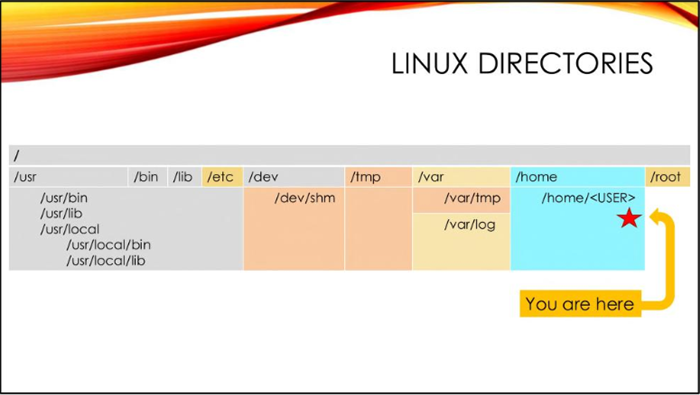
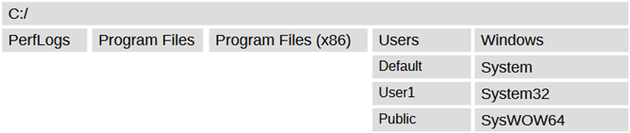
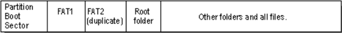
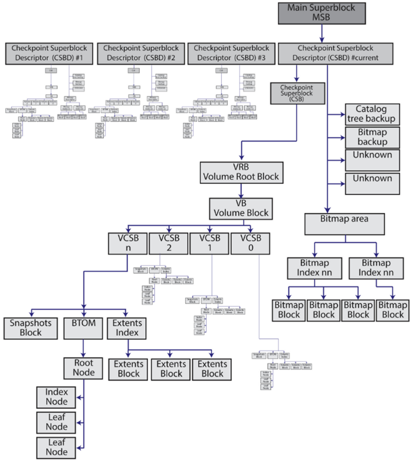
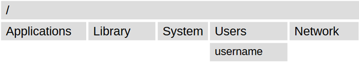

# File Systems
All computer applications need to store and retrieve information. Magnetic disks have been used for years for this long-term storage. But solid-state drives have become popular as they offer fast random access. Think of a disk as a sequence of fixed-size blocks supporting two operations:
1. Read block k.
2. Write block k.  

These are very inconvenient operations, especially on large systems used by multiple applications and users. A few questions that arise:
1. How do you find information?
2. How do you keep one user from reading another user’s data?
3. How do you know which blocks are free? [1]  

Enter: **the file**.  
 
The part of the operating system dealing with files is the **file system**.

## Files
A file is an abstraction, that gives a way to store data on the disk and read it, shielding the user from the details data storage.  
- files may have extensions
  - in Unix like systems, extensions are just conventions, not enforced by the OS
  - in Windows systems, extensions are assigned meaning
- file is just a sequence of bytes, but the OS will execute a file based on its format
  - for example, an executable has five sections: header, text, data, relocation bits, and symbol table
    - the _header_ starts with a so-called _magic number_, identifying the file type
    - after the header are the _text_ and _data_ of the program itself
    - these are loaded into memory and relocated using the _relocation bits_
    - the _symbol table_ is used for debugging

## Directories
To keep track of files, file systems have directories, which are themselves files.
When the file system is organized as a directory tree, file names are specified by one of two methods:
  - **absolute path** names always start at the root directory and are unique
    - In UNIX the components of the path are separated by /. In Windows the separator is \ .
      - The same path name would be:
        - Windows \usr\sss\forensics
        - UNIX /usr/sss/forensics
  - **relative path** names, used in conjunction with the concept of the current working directory

## EXT4
The newest version of an old Unix file system. Similar flavors include FFS (BSD) and UFS (Solaris).  
Other Unix file systems include ZFS, ZFS, or BTRFS, but forensic support is still limited for them.  
### Layers
  
_image and layers source: Hal Pomeranz' Linux Forensics_
- **Physical Layer**: The physical drive or device and the partitions on it.
  - Linux systems often use the old DOS Master Boot Record (MBR) style partitions with four “primary” partitions and chained “extended” (logical) partitions as necessary. GPT (GUID Partition Tables) is a newer disk partitioning scheme designed to overcome the limitations of MBR, and may be found on some Linux systems
  - Even though multiple partitions may exist on the same disk, the Unix operating system treats them as independent devices and performs file I/O via individual entries in the /dev directory— e,g., /dev/sdal, /dev/sda2
- **File System Layer**: Contains all the config and management data associated with the file systems in each partition on the disk
  - When a file system is created in a partition, a data structure is created at the beginning of the partition to define the attributes of the file system. This is called a **superblock**, and it contains:
    -  FS type/size, block size, number of blocks/inodes, etc.
    -  Modification time, last mounted on, clean/dirty status
    -  Pointer to inode for file system journal (EXT3 and above)
- **File Name Layer** (AKA Human Interface Layer): responsible for mapping human readable file names to metadata addresses
  - **Directory files** associate _file names_ to index node (_inode_) numbers in the layer below
  - Directories give the file system its hierarchical structure
- **Metadata Layer**: Contains inodes, the data structures responsible for definition and delineation of files
    - Every file has an inode that contains:
      - File type
      - Access rights
      - Owners
      - Timestamps
      - Size
      - Pointers to data blocks
    - Inodes store everything about the file that you see in the output of "ls — l" except for the file name 
- **Data Layer**: Stores actual file contents - referred to as blocks in Unix file systems (Windows file systems use the term _clusters_ instead)
  - Blocks are composed of sectors (usually 8 in EXT)
    - sectors are the smallest addressable unit of file I/O (usually 512 bytes)
    - to improve performance, EXT normally performs reads/writes in 4K chunks called blocks (512 x 8 = 4096)
  - Blocks that make up a file are allocated consecutively when possible
  - Blocks are organized into Block Groups of 32K blocks
  - Each block group contains inodes and data blocks
### Directory structure
  
_image: Hal Pomeranz' Linux Forensics_
## NTFS
New Technology File System (NTFS) is the default file system for modern Windows-based operating systems. 
Formatting a volume with NTFS results in the creation of several system metadata files that store information about all files and folders on the NTFS volume:
- **$MFT** — Master File Table
- **$Bitmap**
- **$LogFile**
- and others.

### Layout
 
_image source: ntfs.com_
- an NTFS volume starts with the Partition Boot Sector (**$Boot** metadata file), beginning at sector 0 and can be up to 16 sectors 
- $Boot describes NTFS volume information (bytes per sector, sectors per cluster, etc) and the location of the $MFT
- $MFT is the main metadata file, each file in the NTFS volume is represented by a record in this table

 
_image source: ntfs.com_
### Directory structure

### Data streams
NTFS supports multiple data streams:
- a stream name identifies a new data attribute on the file
- a handle can be opened to each data stream

Example: `file.dat:stream2`  
Attackers commonly abuse Alternate Data Streams to [hide artifacts](https://attack.mitre.org/techniques/T1564/004/), like data or payloads, in file metadata instead of file data.

## FAT
- FAT is a series of simple Windows file systems (FAT12, FAT16 and FAT32), that use a file allocation table
- a disk formatted with FAT is allocated in clusters, whose size is determined by the size of the volume
- updating the FAT table is time consuming
- usually found in older removable media (USB sticks, SD cards, etc)
### Structure
 
_image source: ntfs.com_  

## APFS
- default file system for macOS, iOS, tvOS and watchOS
- structured in a container, which can contain one or multiple volumes (or volume groups)
- a container is the primary object of storing data
### Structure
  
_image source: Hansen, K.H., Toolan, F., Decoding the APFS file system, Digital Investigation (2017)_  
### Directory structure

## File carving
- used to extract data from unallocated space on disk, in the absence of file system metadata
- carving based on file structure (magic bytes, header, footer if it exists)
- used when simple file recovery methods fail (files are corrupted, deleted, overwritten)
- main challenge: time-consuming
- tools:
  - hex editors (hexedit, HxD, Bless, etc)
  - scalpel
  - foremost
  - encase
  - binwalk

## Timestamp tampering (timestomping)
- used by attackers to modify file MACB (modification, access, change, birth) metadata
  - (M) Modify – Updated when the file contents are changed
  - (A) Access – Updated when the file contents are accessed (usually via cli, accessing a file via GUI does not always update the access time)
  - (C) Change – Metadata change time for the file i.e. file ownership change
  - (B) Birth – Date the file was created. This is based on the operating system time and exists on EXT4
- purpose: disruption of chronological timeline analysis
- ex. Windows: check time differences between $STANDARD_INFORMATION and $FILE_NAME attributes and $LogFile
  - `istat <disk_image> <inode_number>`
  - parse $LogFile with `logfileparser`
  - analyze any differences between timestamps to indicate tampering
 
## Summary
- summary

## Drills
### Challenge 1 
Description
### Challenge 2
Description
### Challenge 3
Description

## Further reading
[1] Modern Operating Systems by Andrew Tanenbaum, chapter 4 File Systems  
[+] [Linux Forensics by Hal Pomeranz](https://archive.org/details/HalLinuxForensics/) 
### EXT4
[+] [Understanding EXT4 (Part 1): Extents](https://web.archive.org/web/20210618013020/https://www.sans.org/blog/understanding-ext4-part-1-extents/) 
[+] [Understanding EXT4 (Part 2): Timestamps](https://web.archive.org/web/20231203210836/https://www.sans.org/blog/understanding-ext4-part-2-timestamps/) 
[+] [Understanding EXT4 (Part 3): Extent Trees](https://web.archive.org/web/20221015052801/https://www.sans.org/blog/understanding-ext4-part-3-extent-trees/) 
[+] [Understanding EXT4 (Part 4): Demolition Derby](https://web.archive.org/web/20221002010854/https://www.sans.org/blog/understanding-ext4-part-4-demolition-derby/) 
[+] [Understanding EXT4 (Part 5): Large Extents](https://web.archive.org/web/20220630125537/https://www.sans.org/blog/understanding-ext4-part-5-large-extents/) 
[+] [Understanding EXT4 (Part 6): Directories](https://web.archive.org/web/20221003153121/https://www.sans.org/blog/understanding-ext4-part-6-directories/) 
### NTFS
[+] [NTFS overview](https://learn.microsoft.com/en-us/windows-server/storage/file-server/ntfs-overview) 
[+] [Another NTFS overview](https://ntfs.com/ntfs_basics.htm) 
### FAT
[+] [FAT overview](https://forensics.wiki/fat/) 
### APFS
[+] [APFS structure](https://ntfs.com/apfs-structure.htm) 
[+] [Sistemul de fisiere APFS](https://support.apple.com/ro-ro/guide/disk-utility/dsku19ed921c/mac) 
