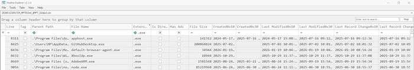

# Disk Analysis
After data has been extracted and measures taken to maintain integrity, we focus on initial event analysis.  
Early triage can offer indication of the type of incident investigated (ransomware, insider threat, cryptojacking, etc.), based on which we look for obvious IoCs. At this stage:
- high potential for false positives
- include anything that looks suspicious and rule out later
- analyze system and user activity artifacts, including logs
- narrow down to timeframe of suspicious activity

## Looking for evil
Attackers leave breadcrumbs everywhere: program installation, execution, file modification, user account usage. 
Investigators are looking for anything out of the ordinary. This implies taking time to learn what normal looks like. 
Types of data on disk:
- file system metadata
- allocated files 
- deleted files
- unallocated space and slack space

### File system metadata
- inodes on Unix
  - displays inode number, file type, permissions, owner uid/guid, file size, timestamps, block pointers but not the filename

- $MFT file on Windows
  - displays FILE record header, $STANDARD_INFORMATION, $FILE_NAME, $DATA

### Evidence of past file presence
- USN Journal, Windows Search Index

### Evidence of execution
- Prefetch files, SRUM
- Registry (UserAssist, ShimCache / AppCompatCache, AmCache, RunMRU)

### Log analysis
- unix logs
  - found under /var/log by convention, but can be placed anywhere
  - usually simple text files (easy for attackers to edit or remove)
  - format varies widely (starts with timestamp, hostname, process name, pid, and the rest is left to the developers)
    - syslog - primary logging service that routes logs to different destinations (including over the network)
    - /var/log/wtmp - user logins and system reboots, read with `last -if <logfile>`
    - /var/log/btmp - failed logins, not enabled by default, read with `lastb -if <logfile>`
    - /var/log/lastlog - last login info for each user, read with `lastlog`
    - web server logs - often document initial compromise
- windows event logs
  - security logs
    - eventID 4624 and 4634 - logon and logoff
    - eventID 4625 - failed logon
    - eventID 4672 - privilege escalation
    - eventID 4688 - new process created
  - application logs
  - system logs
  - sysmon event logs (optional, will be integrated in Windows 11 and Server 2025, but off by default)
    - eventID 1 - process creation
    - eventID 8 - CreateRemoteThread (indicator of process injection)
    - eventID 10 - process access (indicator of post-exploitation, credential dumping, process injection)

### App & user activity artifacts
- Registry (RecentDocs, OpenSaveMRU, ShellBags)

### Command history
- bash_history - standard Unix shell command history
  - simple text file, can be easily deleted, more info [here](https://www.youtube.com/watch?v=wv1xqOV2RyE)
- cmd history
- powershell history

### Browser artifacts
- browsing history, search, cookies, credentials, bookmarks, autofill
  - Firefox or Chromium on Unix
  - Chrome or Firefox on Windows
  - Safari on macOS

### Persistence
- rootkits (Loadable Kernel Modules)
- scheduled tasks
- service start-up scripts
- account modification (new admin accounts, new ssh authorized_keys, enhanced sudo privileges uid 0)
- Registry (Run/RunOnce Keys, Windows Services, Winlogon, Scheduled Tasks)

## Timeline analysis
Timeline analysis serves in piecing the breadcrumbs together into a coherent record of the intrusion. Timelines are a guide to evidence, not evidence themselves. 
Timestamps are ephemeral: we only see the last modified time, change time, admin users are allowed to change timestamps.
- on Unix:
  - collect raw timestamp data into a body file (ex. with `fls` from Sleuthkit)
  - generate csv timeline with `mactime`
  - visualize with Timeline Explorer from EZ Tools
- on Windows:
  - extract the $MFT table with `mftecmd.exe`
  - visualize with Timeline Explorer from EZ Tools
### Time normalization
- make sure all timestamps are converted to UTC before analysis starts
- multiple timezones in between physical or cloud investigated devices can slow analysis

## [Autopsy](https://www.autopsy.com/download/)
- start a case
- select data source (evidence already acquired)
- analyze artifacts (installed programs, metadata, recent documents, run programs, shellbags, web accounts, cookies, history)

## [bulk_extractor](https://github.com/simsong/bulk_extractor)
- scans and extracts structured information (ex. emails, CCN, JPEGs, JSON snippets) without parsing file system structures

## Summary
- summary

## Drills
### Challenge 1
Description
### Challenge 2
Description
### Challenge 3
Description

## Further reading
[+] [Windows Registry Forensics](https://www.cybertriage.com/blog/windows-registry-forensics-cheat-sheet-2025/) 
[+] [Windows Event IDs]([https://www.ultimatewindowssecurity.com/](https://www.ultimatewindowssecurity.com/securitylog/encyclopedia/)) 
[+] [You don't know jack about bach history](https://www.youtube.com/watch?v=wv1xqOV2RyE) 
[+]  
[+]  
[+]  
