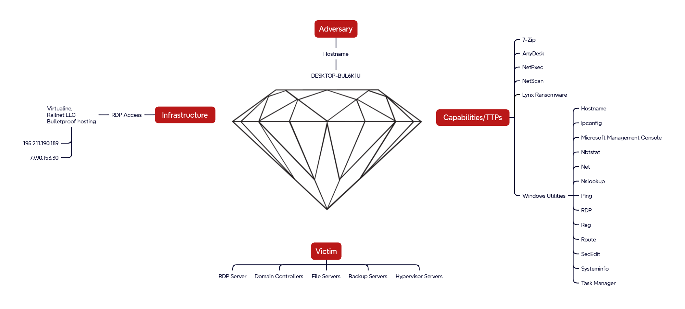

# Forensic investigation methodology
[Digital forensics](https://www.nist.gov/digital-evidence) is the field of forensic science concerned with ***retrieving, storing and analyzing*** data that can be useful in investigations.  
This includes information from computers, mobile phones, IoT devices, motor vehicles, drones, or the cloud.  
 
A 10 step investigation methodology:  
 
*image source: Digital Forensics and Incident Response, Gerard Johansen*
 
 
**Digital forensic investigators** face challenges such as:
- extracting data from damaged devices;
- locating evidence among vast quantities of data;
- ensuring that their methods capture data **reliably**, without altering it in any way.

The term **DFIR (Digital Forensics and Incident Response)** is often used referring to the broader discipline including incident response.

## Objectives of the [digital forensic process](https://www.unodc.org/cld/en/education/tertiary/cybercrime/module-4/key-issues/standards-and-best-practices-for-digital-forensics.html)
- identification;
- collection;
- analysis;
- reporting;
- preservation.

## Evidence
Main _**types of evidence**_ retrieved and analyzed:
- disk (files, logs, command history, browser artifacts, etc.);
- memory (process, linked libraries, network connections, etc.);
- network capture.

## Chain of custody
Preserving the *integrity* of the evidence (preventing alteration or deletion) is prioritized.  
**Chain of custody** is used to track evidence by documenting each person and organization who handles it, the date/time it was collected or transferred, and the purpose of the transfer.  
 
Example [chain of custody form](https://www.oreilly.com/library/view/implementing-digital-forensic/9780128045015/XHTML/B9780128044544150142/B9780128044544150142.xhtml): 

 
## Case examples
[Cat's Got Your Files: Lynx Ransomware](https://thedfirreport.com/2025/11/17/cats-got-your-files-lynx-ransomware/)
- initial access: RDP with compromised credentials to internet-exposed system
- internal recon: enumerate virtual infrastructure and file shares using standard windows utilities and [netscan](https://www.softperfect.com/products/networkscanner/), then [NetExec](https://github.com/Pennyw0rth/NetExec)
- lateral movement: to Domain Controller via separate compromised domain account (likely obtained from initial access broker)
- persistence: create new accounts via [dsa.msc](https://learn.microsoft.com/en-us/windows-server/identity/ad-ds/manage-user-accounts-in-windows-server), install AnyDesk client 
- privilege escalation: add new accounts to privileged groups
- exfil: sensitive files from network shares, 7z compressed via temporary file service [temp.sh](http://temp.sh)
- c2: RDP, AnyDesk (installed but not used)
- ransomware deployment: delete backup jobs, deploy lynx across multiple backup and file servers via RDP 

[From a Single Click: How Lunar Spider Enabled a Near Two-Month Intrusion](https://thedfirreport.com/2025/09/29/from-a-single-click-how-lunar-spider-enabled-a-near-two-month-intrusion/)
- initial access: javascript file disguised as tax form, downloads and executes Brute Ratel via MSI installer
- internal recon: standard windows utilities, ADFind, rustscan, powerview
- lateral movement: PsExec, custom tool using Zerologon (CVE-2020-1472), RDP
- persistence: registry Run key named Update executing Brute Ratel badger, custom .NET backdoor via scheduled task, setup an additional C2 channel
- privilege escalation: Windows’ Secondary Logon service to enable runas with admin credentials found in unattend.xml file, UAC bypass via Cobalt Strike [uac-token-duplication](https://hstechdocs.helpsystems.com/manuals/cobaltstrike/current/userguide/content/topics/post-exploitation_privilege-escalation.htm)
- exfil: Rclone, FTP
- c2: Latrodectus/BackConnect VNC, Brute Ratel, lsassa.exe .NET malware, metasploit, Cobalt Strike
- credential harvesting: lsass, Latrodectus stealer module extracted from Outlook by querying registry keys, unattend.xml file, [.ps1 file](https://github.com/sadshade/veeam-creds) targeting backup software Veeam 

## Summary
- digital forensics includes retrieving, storing and analyzing data
- investigator's challenges: extraction, finding evidence in large amounts of data, reliability
- objectives: identify, collect, analyze, report, preserve
- evidence sources: disk, memory, network
- chain of custody is a priority
## Drills
### Challenge 1
Description
### Challenge 2
Description
### Challenge 3
Description

## Further reading
ISO/IEC 27037:2012
[Chain of custody](https://www.cisa.gov/sites/default/files/publications/cisa-insights_chain-of-custody-and-ci-systems_508.pdf) 
Digital Forensics and Incident Response book by Gerard Johansen 
