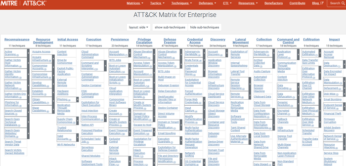

# Investigation: initial access & execution
The most frequently asked questions of the forensic investigator:
- what happened?
  - what type of incident this is (ransomware, data exfil, insider threat, etc.) 
- when did the breach first occur?
  - how was it detected?
  - is the attack ongoing?
  - what is the earliest indicator of compromise? (dwell time)
- how did the attackers get in?
  - initial access (phishing, web app exploit, exposed login portal, etc.)
  - known vulnerabilities exploited?
  - were credentials stolen or bruteforced? MFA bypassed?
- what systems are affected?
  - which endpoints, server, cloud resources are compromised?
  - are backups impacted?
  - are domain controllers affected? did the attacked gain administrative or domain-level access?
  - what data is at risk?
- what did the attacker do?
  - was data accessed, exfiltrated, or altered?
  - were backdoors or persistence mechanisms installed?
  - was lateral movement observed?
  - were logs deleted or tampered with?
- who is responsible?
  - known [threat actor](https://attack.mitre.org/groups/)? ransomware gangs, nation-state activity, hacktivism?
  - insider involvement?
- what must be done immediately?
  - should credentials be reset?
  - should systems be isolated?
  - should law enforcement or regulators be notified?
  - should Incident Response plans be triggered?

While the MITRE ATT&CK Matrix lists Reconnaissance and Resource Development first, this class will focus on Initial Access and Execution. 

## Initial access vectors
- phishing - the most common
  - targeted or non-targeted
- valid accounts
  - attackers don't break in, they log in
  - default accounts
  - credential stuffing from previous breach data
- exploit public-facing application
  - web apps, APIs (see [OWASP Top 10](https://owasp.org/Top10/2025/))
  - SSH, exposed ESXi OpenSLP services, exposed VMware vCenter servers
- external remote services
  - VPNs, Citrix
  - WinRM, VNC
  - Docker API, Kubernetes API server, kubelet, Kubernetes dashboard
- trusted relationship
  - third parties with delegated permissions
- supply chain compromise
  - software dependencies
  - CI/CD pipeline components (ex. Github Actions)
- others

## Execution
- user execution
  - social engineering to execute malicious code or open a malicious document or link
  - enabling remote access tools (RAT)
  - running malicious javascript in the browser that steals session cookies
- command and scripting interpreter
  - cli interfaces (unix shells, powershell, cmd), python, visual basic, javascript
  - used to execute initial access payloads
- others

### Known Exploited Vulnerabilities

## Investigate case "Breaking Dawn"
Disk evidence: [TODO]() 
Memory evidence: [TODO]() 

First, we check the memory dump:
- list processes and process tree

Next, the disk image:
- analyze $MFT starting from the breadcrumbs found in memory
- analyze logs (process creation EID 1, process access EID 10)

## Summary
- initial access frequently phishing, stolen credentials to exposed remote services
- execution frequently user execution via social engineering

### Challenge 1
Description
### Challenge 2
Description
### Challenge 3
Description

## Further reading
[+] [MITRE ATT&CK Matrix](https://attack.mitre.org/) 
[+] [Threat actor groups](https://attack.mitre.org/groups/) 
[+] [OWASP Top 10](https://owasp.org/Top10/2025/) 
[+] [Known Exploited Vulnerabilities](https://www.cisa.gov/known-exploited-vulnerabilities-catalog) 
[+]  
[+]  
[+]  
[+]  
[+]  
